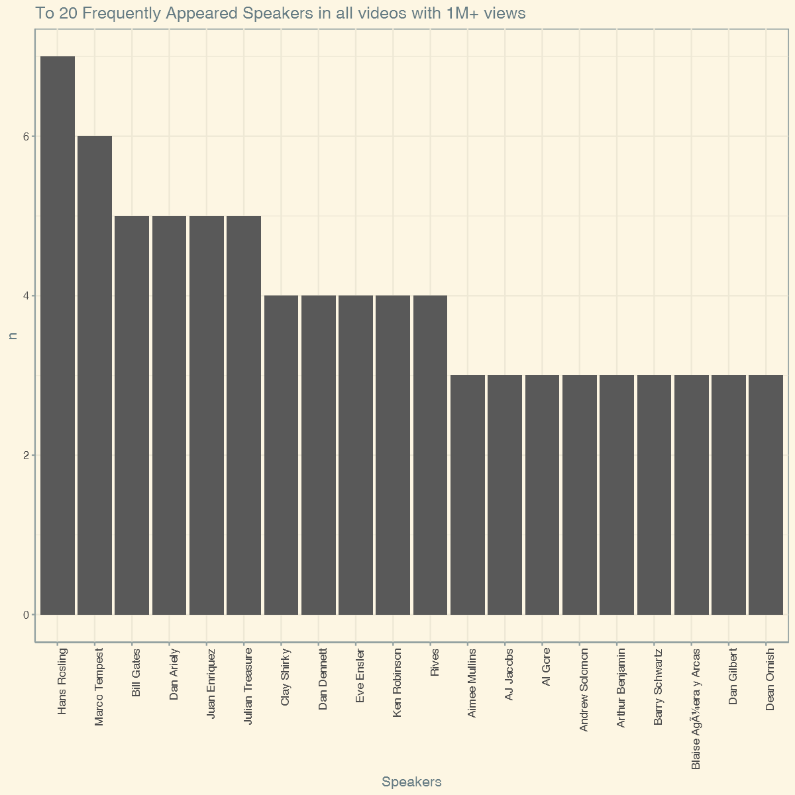
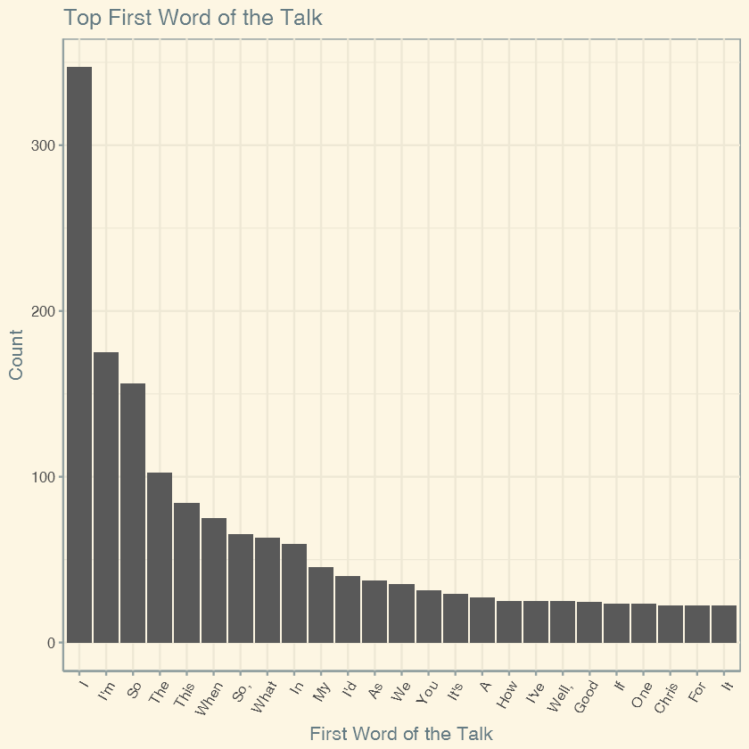

```R
options(scipen=999)
```


```R
library(dplyr); library(ggplot2); library(ggthemes);
```


```R
transcripts <- read.csv('../input/transcripts.csv',stringsAsFactors=F, header = T)
main <- read.csv('../input/ted_main.csv',stringsAsFactors=F, header = T)
```

### Total Number of Rows/Entries in the Main Dataset


```R
nrow(main)
```


2550


### Entries with more >= 1M views


```R
paste0('Total Number of videos with more than 1M views: ',main %>% filter(views > 1000000) %>% count() )
paste0('% of videos with more than 1M views: ', round((main %>% filter(views > 1000000) %>% count() / nrow(main))*100,2),'%')
```


'Total Number of videos with more than 1M views: 1503'


'% of videos with more than 1M views: 58.94%'


###  Not so one-trick Pony!


```R
main %>% filter(views > 1000000) %>% 
group_by(main_speaker) %>% 
count() %>% 
filter(n >2) %>% 
arrange(desc(n)) %>% 
head(20) %>% 
ggplot() + geom_bar(aes(reorder(main_speaker,-n),n),stat='identity') + theme_solarized() + 
theme(axis.text.x = element_text(angle = 90, hjust = 1)) + xlab('Speakers') + 
ggtitle('To 20 Frequently Appeared Speakers in all videos with 1M+ views')
```





### Less Time More Impact 


```R
main %>% filter(views > 1000000) %>% arrange(duration) %>% slice(1:10) %>% select('name','duration','views','event')
```


<table>
<thead><tr><th scope=col>name</th><th scope=col>duration</th><th scope=col>views</th><th scope=col>event</th></tr></thead>
<tbody>
	<tr><td>Derek Sivers: Weird, or just different?            </td><td>162                                                </td><td>2835976                                            </td><td>TEDIndia 2009                                      </td></tr>
	<tr><td>Paolo Cardini: Forget multitasking, try monotasking</td><td>172                                                </td><td>2324212                                            </td><td>TEDGlobal 2012                                     </td></tr>
	<tr><td>Mitchell Joachim: Don't build your home, grow it!  </td><td>176                                                </td><td>1332785                                            </td><td>TED2010                                            </td></tr>
	<tr><td>Arthur Benjamin: Teach statistics before calculus! </td><td>178                                                </td><td>2175141                                            </td><td>TED2009                                            </td></tr>
	<tr><td>Terry Moore: How to tie your shoes                 </td><td>179                                                </td><td>6263759                                            </td><td>TED2005                                            </td></tr>
	<tr><td>Malcolm London: "High School Training Ground"      </td><td>180                                                </td><td>1188177                                            </td><td>TED Talks Education                                </td></tr>
	<tr><td>Bobby McFerrin: Watch me play ... the audience!    </td><td>184                                                </td><td>3302312                                            </td><td>World Science Festival                             </td></tr>
	<tr><td>Derek Sivers: How to start a movement              </td><td>189                                                </td><td>6475731                                            </td><td>TED2010                                            </td></tr>
	<tr><td>Bruno Maisonnier: Dance, tiny robots!              </td><td>189                                                </td><td>1193896                                            </td><td>TEDxConcorde                                       </td></tr>
	<tr><td>Dean Ornish: Your genes are not your fate          </td><td>192                                                </td><td>1384333                                            </td><td>TED2008                                            </td></tr>
</tbody>
</table>


### Skeeeeewed Views


```R
ggplot(main) + geom_histogram(aes(views)) + ggtitle('Histogram of Views') + theme_solarized()
```

    `stat_bin()` using `bins = 30`. Pick better value with `binwidth`.
    


```R
main$first_letter <- substr(main$main_speaker,1,1)
```

### J/S/A - Seems the magical First Letter!


```R
main %>% 
group_by(first_letter = toupper(first_letter)) %>% 
count() %>% 
arrange(desc(n)) %>% 
ggplot() + 
geom_bar(aes(reorder(first_letter,-n),n),stat = 'identity') + theme_solarized() + 
xlab('Speaker First Letter') +
ylab('Count') + 
ggtitle('Popular First Letter of Author Names appearing in TED Talks')
```


```R
tedx <- main %>% filter(grepl('tedx',tolower(event)))

tedx %>% count()
```


<table>
<thead><tr><th scope=col>n</th></tr></thead>
<tbody>
	<tr><td>471</td></tr>
</tbody>
</table>


### TEDx %in% TED


```R
tedx %>% filter(views > 1000000) %>% 
group_by(event) %>% 
count() %>% 
filter(n >2) %>% 
arrange(desc(n)) %>% 
head(20) %>% 
ggplot() + geom_bar(aes(reorder(event,-n),n),stat='identity') + theme_solarized() + 
theme(axis.text.x = element_text(angle = 90, hjust = 1)) + xlab('TEDx Events') + 
ggtitle('Top 20 TEDx Events that more talks with 1M+ views on TED.com')
```


### Top Comments - Atheism/Schools/Science!


```R
main %>% 
arrange(desc(comments)) %>% 
head(10) %>% 
ggplot() + 
geom_bar(aes(reorder(title,-comments),comments),stat = 'identity') + theme_solarized() + 
xlab('Talk Name') +
ylab('Count') + 
ggtitle('Talks with Most comments') + 
theme(axis.text.x = element_text(angle = 60, hjust = 1)) 
```


```R
transcripts$first_word <- unlist(lapply(transcripts$transcript, function(x) strsplit(x," ")[[1]][1]))
```

### Narcissim ?


```R
transcripts %>% group_by(first_word) %>% count() %>% arrange(desc(n)) %>% head(25) %>%
ggplot() + 
geom_bar(aes(reorder(first_word,-n),n),stat = 'identity') + theme_solarized() + 
xlab('First Word of the Talk') +
ylab('Count') + 
ggtitle('Top First Word of the Talk') + 
theme(axis.text.x = element_text(angle = 60, hjust = 1))
```




